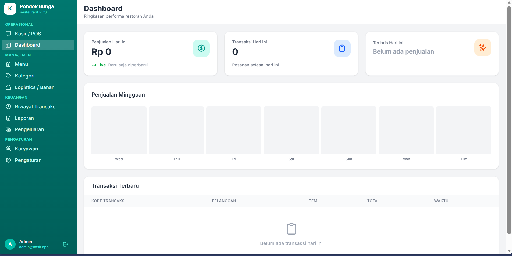
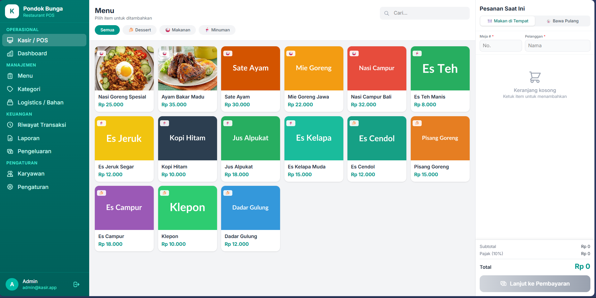

<p align="center">
  
</p>

<h1 align="center">🍽️ RestoAdmin POS</h1>

<p align="center">
  <strong>Sistem Point of Sale (POS) Modern untuk Restoran</strong>
</p>

<p align="center">
  
  
  
  
</p>

---

## 📋 Deskripsi

**RestoAdmin POS** adalah aplikasi Point of Sale (POS) berbasis web yang dirancang khusus untuk bisnis restoran dan kafe. Dibangun dengan teknologi modern Laravel 12 dan Livewire 3, aplikasi ini menawarkan antarmuka yang responsif dengan tema dark mode yang elegan.

Aplikasi ini menyediakan solusi lengkap untuk mengelola operasional harian restoran, mulai dari pemesanan menu, manajemen produk, hingga pelaporan transaksi.

---

## ✨ Fitur Utama

### 🛒 Point of Sale (POS)
- Antarmuka kasir yang intuitif dan responsif
- Pencarian produk dengan filter kategori
- Keranjang belanja dengan catatan khusus per item
- Dukungan tipe pesanan: **Dine In** & **Take Away**
- Perhitungan otomatis subtotal, pajak, dan diskon
- Modal pembayaran dengan quick cash options
- Cetak struk pembayaran (PDF)

### 📊 Dashboard
- Ringkasan penjualan hari ini
- Jumlah transaksi harian
- Produk terlaris (best seller)
- Grafik penjualan mingguan
- Daftar transaksi terbaru

### 📦 Manajemen Produk
- CRUD produk lengkap (Create, Read, Update, Delete)
- Upload gambar produk dari galeri lokal
- Kategori produk dengan ikon & warna kustom
- Pencarian dan filter produk

### 🏷️ Manajemen Kategori
- Buat dan kelola kategori produk
- Pilihan ikon dan warna untuk setiap kategori
- Kontrol status aktif/nonaktif kategori

### 💳 Riwayat Transaksi
- Daftar lengkap semua transaksi
- Filter berdasarkan tanggal dan tipe pesanan
- Detail transaksi dengan daftar item
- Cetak ulang struk (reprint receipt)

### 📈 Laporan
- Laporan penjualan (harian, mingguan, bulanan)
- Download laporan dalam format PDF
- Statistik pendapatan dan transaksi

### 👥 Manajemen Karyawan
- Kelola data karyawan
- Pengaturan role dan akses

### 💰 Manajemen Pengeluaran
- Catat pengeluaran operasional
- Kategorisasi pengeluaran
- Laporan pengeluaran

### 📦 Logistik
- Manajemen stok dan inventaris
- Tracking persediaan barang

### ⚙️ Pengaturan
- **Informasi Restoran**: Nama dan alamat restoran
- **Pajak**: Persentase pajak yang dapat disesuaikan
- **Diskon**: 
  - Pengaturan diskon otomatis
  - Minimal item atau total pembelian
  - Mode kondisi (by items / by total)
- **Manajemen Data**:
  - Backup database (JSON)
  - Restore database dari file backup
  - Reset seluruh data
  - Clear cache aplikasi

---

## 🛠️ Tech Stack

| Teknologi | Versi | Deskripsi |
|-----------|-------|-----------|
| **PHP** | ^8.2 | Server-side language |
| **Laravel** | 12.x | PHP Framework |
| **Livewire** | 3.7 | Full-stack framework untuk Laravel |
| **TailwindCSS** | 4.x | Utility-first CSS framework |
| **Vite** | 7.x | Build tool & dev server |
| **SQLite** | - | Database (default) |
| **DomPDF** | 3.1 | Generate PDF reports/receipts |

---

## 📁 Struktur Proyek

```
app-pos/
├── app/
│   ├── Http/Controllers/     # Controller (Auth, Report)
│   ├── Livewire/             # Komponen Livewire
│   │   ├── Categories.php
│   │   ├── Dashboard.php
│   │   ├── Employees.php
│   │   ├── Expenses.php
│   │   ├── Logistics.php
│   │   ├── PosPage.php
│   │   ├── Products.php
│   │   ├── Reports.php
│   │   ├── Settings.php
│   │   └── Transactions.php
│   └── Models/               # Eloquent Models
│       ├── Category.php
│       ├── Expense.php
│       ├── Logistic.php
│       ├── Product.php
│       ├── Transaction.php
│       ├── TransactionDetail.php
│       └── User.php
├── database/
│   └── migrations/           # Database migrations
├── resources/
│   └── views/
│       ├── auth/             # Login page
│       ├── layouts/          # App layout
│       ├── livewire/         # Livewire views
│       └── pdf/              # PDF templates
├── routes/
│   └── web.php               # Route definitions
└── storage/
    └── app/
        └── settings.json     # Application settings
```

---

## 🚀 Instalasi

### Prasyarat

Pastikan sistem Anda telah terinstal:
- **PHP** >= 8.2
- **Composer** (PHP package manager)
- **Node.js** >= 18.x
- **NPM** atau **Yarn**

### Langkah Instalasi

1. **Clone repository**
   ```bash
   git clone https://github.com/your-username/app-pos.git
   cd app-pos
   ```

2. **Install dependencies PHP**
   ```bash
   composer install
   ```

3. **Install dependencies Node.js**
   ```bash
   npm install
   ```

4. **Salin file environment**
   ```bash
   cp .env.example .env
   ```

5. **Generate application key**
   ```bash
   php artisan key:generate
   ```

6. **Buat database SQLite**
   ```bash
   # Windows
   type nul > database/database.sqlite

   # Linux/MacOS
   touch database/database.sqlite
   ```

7. **Jalankan migration**
   ```bash
   php artisan migrate
   ```

8. **Buat user admin** (opsional)
   ```bash
   php artisan tinker
   ```
   Kemudian jalankan:
   ```php
   \App\Models\User::create([
       'name' => 'Admin',
       'email' => 'admin@example.com',
       'password' => bcrypt('password123'),
   ]);
   ```

### 📌 Quick Setup (Alternatif)

Gunakan script setup otomatis:
```bash
composer setup
```

---

## 💻 Menjalankan Aplikasi

### Development Mode

Jalankan kedua perintah ini di terminal terpisah:

**Terminal 1 - Laravel Server:**
```bash
php artisan serve
```

**Terminal 2 - Vite Dev Server:**
```bash
npm run dev
```

Atau gunakan script `dev` untuk menjalankan semuanya sekaligus:
```bash
composer dev
```

### Akses Aplikasi

Buka browser dan akses:
```
http://localhost:8000
```

---

## 🔐 Autentikasi

Aplikasi menggunakan sistem autentikasi berbasis session dengan Laravel Auth.

### Login Default

Jika Anda telah membuat user admin:
- **Email:** `admin@example.com`
- **Password:** `password123`

---

## 📸 Screenshots

> *Tambahkan screenshots aplikasi di sini*

| Dashboard | POS Page |
|-----------|----------|
|  |  |

| Products | Transactions |
|----------|--------------|
|  |  |

---

## 🗄️ Database Schema

### Tables

| Table | Deskripsi |
|-------|-----------|
| `users` | Data pengguna dan karyawan |
| `products` | Daftar menu/produk |
| `categories` | Kategori produk |
| `transactions` | Header transaksi |
| `transaction_details` | Detail item transaksi |
| `expenses` | Catatan pengeluaran |
| `logistics` | Data logistik/inventaris |

---

## ⚙️ Konfigurasi

### Environment Variables (.env)

```env
APP_NAME="RestoAdmin POS"
APP_ENV=local
APP_DEBUG=true
APP_URL=http://localhost:8000

DB_CONNECTION=sqlite
DB_DATABASE=/absolute/path/to/database.sqlite
```

### Settings (storage/app/settings.json)

```json
{
    "restaurant_name": "Nama Restoran",
    "restaurant_address": "Alamat Restoran",
    "tax_percentage": 10,
    "discount_percentage": 0,
    "discount_min_items": 1,
    "discount_min_total": 0,
    "discount_condition_mode": "total",
    "discount_enabled": true
}
```

---

## 🧪 Testing

Jalankan unit test:
```bash
php artisan test
```

Atau menggunakan PHPUnit langsung:
```bash
./vendor/bin/phpunit
```

---

## 📦 Build untuk Production

1. **Build assets**
   ```bash
   npm run build
   ```

2. **Optimize Laravel**
   ```bash
   php artisan config:cache
   php artisan route:cache
   php artisan view:cache
   ```

---

## 🔧 Troubleshooting

### Vite Manifest Not Found

Jika muncul error "Vite manifest not found":
```bash
npm run dev
# atau untuk production:
npm run build
```

### Database Migration Error

Jika migration gagal:
```bash
php artisan migrate:fresh
```

### Cache Issues

Clear semua cache:
```bash
php artisan optimize:clear
```

---

## 🤝 Kontribusi

Kontribusi sangat diterima! Silakan:

1. Fork repository ini
2. Buat branch fitur (`git checkout -b feature/AmazingFeature`)
3. Commit perubahan (`git commit -m 'Add some AmazingFeature'`)
4. Push ke branch (`git push origin feature/AmazingFeature`)
5. Buat Pull Request

---

## 📄 Lisensi

Proyek ini dilisensikan di bawah [MIT License](https://opensource.org/licenses/MIT).

---

## 👨‍💻 Pengembang

Dibuat dengan ❤️ untuk mempermudah manajemen restoran Anda.

---

<p align="center">
  <strong>⭐ Jika proyek ini membantu, jangan lupa berikan bintang! ⭐</strong>
</p>
